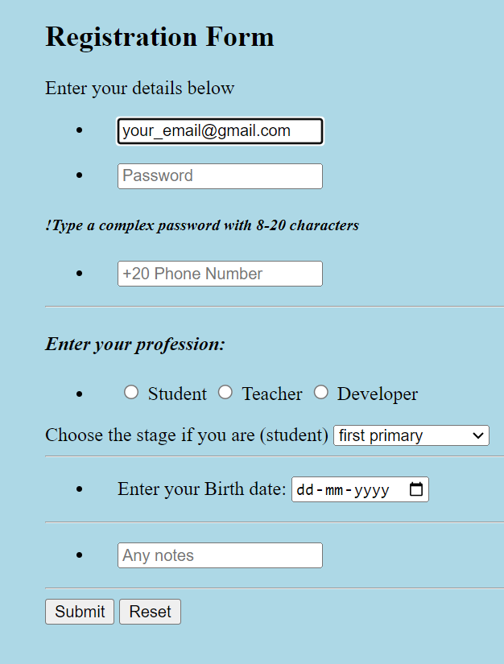

# Registration Form

## Project Description

This project is a simple registration form built using HTML and CSS. The form allows users to enter their details such as name, email, password, and other relevant information. The primary purpose of this project is to demonstrate basic form creation and styling techniques using web technologies.

### Features

- **User-Friendly Interface**: Simple and intuitive design for easy user interaction.
- **Input Validation**: Basic client-side validation for required fields to ensure users enter necessary information.

### Technologies Used

- **HTML**: Structure of the form
- **CSS**: Styling of the form elements and layout

### Screenshot

Here is a screenshot of the registration form:



### How to Use

1. Clone the repository:
   ```bash
   git clone https://github.com/palaksinghalaggarwal/registration-form.git

2. Navigate to the project directory:
   cd registration-form

3. Open 'index.html' in your web browser to view the form.

License
This project is licensed under the MIT License. See the LICENSE file for more details.

Author
Created by Palak Gupta.

Contributions
Contributions are welcome! Please open an issue or submit a pull request for any changes or improvements.